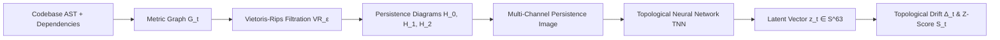

<div align="center">

# ⛓️ TopoChain

**Topological Invariant Drift Detection for Software Supply Chain Integrity**

*Detecting malicious code injections, dependency compromises, and stealth logic backdoors using Algebraic Topology & Topological Neural Networks (TNNs).*

[](LICENSE)
[](https://www.python.org/)
[](https://github.com/scikit-tda/ripser.py)
[](https://pytorch.org/)
[]()

</div>

---

## 📌 Executive Summary

Traditional Software Composition Analysis (SCA) and Static Application Security Testing (SAST) tools rely on known CVE databases, cryptographic hash matching, and syntactic rule patterns. These mechanisms fail against novel supply chain attacks:
1. **Zero-day logic backdoors** do not match any known CVE signature.
2. **Cryptographic hashes** fluctuate on every commit, masking malicious insertions in noisy differentials.
3. **LLM-based reviewers** lack mathematical stability guarantees and can be deceived through code obfuscation.
4. **Syntactic diffing** cannot distinguish when the *fundamental geometric topology* of code logic has been maliciously altered.

**TopoChain** solves this by mapping the Abstract Syntax Tree (AST) and dependency graph of a codebase into a high-dimensional **simplicial complex**. It computes the **persistent homology** (topological invariants $H_0, H_1, H_2$) across commits and uses a lightweight **Topological Neural Network (TNN)** to learn the natural evolutionary manifold of the repository. When a supply chain attack occurs, it induces a **topological defect**—a statistically significant drift in structural shape that bypasses syntactic evasion.

---

## 📐 Core Mathematical Primitive: Topological Drift



### 1. Filtration & Invariants
Let $G_t = (V_t, E_t, w_t)$ be the weighted code and dependency graph at commit $t$. We construct a Vietoris-Rips filtration:
$$\emptyset = K_t^0 \subseteq K_t^{\epsilon_1} \subseteq \dots \subseteq K_t^{D_{\max}} = K_t$$

Persistent homology yields persistence diagrams $D_k^t = \{(b_i, d_i)\}$, representing the birth and death of topological invariants:
- **$H_0$ (Connected Components):** Module clustering and isolated dependency structures.
- **$H_1$ (1D Topological Loops):** Closed call cycles, recursive data flows, and stealth feedback hooks.
- **$H_2$ (2D Cavities):** Multi-way circular interactions between triangular cliques.

### 2. Topological Neural Network & Latent Space
Persistence diagrams are converted into multi-channel 2D persistence images $\mathbf{X}_t \in \mathbb{R}^{3 \times 32 \times 32}$. A lightweight TNN maps $\mathbf{X}_t$ onto a unit hypersphere $\mathbb{S}^{63} \subset \mathbb{R}^{64}$:
$$\mathbf{z}_t = \phi_\theta(\mathbf{X}_t), \quad \|\mathbf{z}_t\|_2 = 1$$

### 3. Anomaly Scoring
The **topological drift** between successive commits is:
$$\Delta_t = \|\mathbf{z}_t - \mathbf{z}_{t-1}\|_2$$
Maintaining a running mean $\mu$ and variance $\sigma^2$ across benign commits via Welford's streaming algorithm, the normalized anomaly score is:
$$S_t = \frac{\Delta_t - \mu}{\sqrt{\sigma^2 + \epsilon}}$$
If $S_t > \tau$ (default $\tau = 3.0$, corresponding to $99.7\%$ confidence boundary under normal variation) or structural defects (`LOOP_BIRTH_ANOMALY`, `SUSPICIOUS_SENSITIVE_HOOK_INJECTION`) are detected, the commit is flagged and quarantined.

---

## 🚀 Quickstart

### Installation

```bash
# Clone repository
git clone https://github.com/your-org/topochain.git
cd topochain

# Install with pip or uv
pip install -e .
```

### 1. Interactive Demonstration

Experience TopoChain in action. It simulates a benign microservice baseline, a safe code refactoring, and a stealthy supply chain attack injection:

```bash
topochain demo
```

```text
┌─────────────────┬────────────┬─────────┬──────────────────┬─────────────────────────────────┐
│ Stage / Commit  │ Drift (L2) │ Z-Score │ Verification     │ Defect Reason                   │
├─────────────────┼────────────┼─────────┼──────────────────┼─────────────────────────────────┤
│ c0: Baseline    │ 0.0000     │ -2.12   │ PASS             │ Manifold anchor                 │
│ c1: Refactor    │ 0.0457     │ -1.47   │ PASS             │ Homotopic evolution             │
│ c2: Backdoor    │ 0.0431     │ -0.04   │ BLOCKED          │ ['UNCONNECTED_ISLAND_INJECTION',│
│                 │            │         │ (ANOMALY)        │  'SUSPICIOUS_SENSITIVE_HOOK']   │
└─────────────────┴────────────┴─────────┴──────────────────┴─────────────────────────────────┘
```

### 2. Initialize a Repository

Initialize local SQLite state and baseline statistics:

```bash
topochain init --repo ./my-project --name "my-service"
```

### 3. Scan a Commit in CI/CD

```bash
topochain scan --repo ./my-project --commit HEAD --threshold 3.0 --visualize
```

- **Exit Code 0:** Commit passed topological integrity verification.
- **Exit Code 1:** Topological anomaly or defect detected; CI/CD pipeline blocked.

To output machine-readable JSON for automated gates:
```bash
topochain scan --repo ./my-project --json-output
```

### 4. Run the REST API

```bash
topochain serve --host 127.0.0.1 --port 8000
```
Interactive Swagger documentation will be available at `http://127.0.0.1:8000/docs`.

---

## 📁 Repository Structure

```text
topochain/
├── cli/                # Command-line interface (Click + Rich)
│   └── main.py
├── core/
│   ├── extractor/      # AST (Python + JS) and dependency parsing
│   │   ├── python_extractor.py
│   │   ├── js_extractor.py
│   │   ├── dependency_extractor.py
│   │   └── codebase_extractor.py
│   ├── graph/          # Weighted graph construction & Dijkstra metric space
│   │   ├── builder.py
│   │   └── weighting.py
│   ├── topology/       # Vietoris-Rips filtration & persistence diagrams (Ripser)
│   │   ├── homology.py
│   │   ├── pers_image.py
│   │   └── visualizer.py
│   ├── drift/          # Topological drift calculation & RCA diagnostics
│   │   ├── detector.py
│   │   └── diagnostics.py
│   ├── db/             # SQLite storage engine for commit topologies
│   │   └── storage.py
│   └── orchestrator.py # Unified end-to-end verification pipeline
├── ai/
│   ├── models/         # Topological Neural Network (TNN) architecture
│   │   └── tnn.py
│   ├── training/       # Contrastive & triplet loss training
│   │   └── trainer.py
│   └── inference/      # Low-latency TNN inference runner (<50ms)
│       └── engine.py
├── data/
│   ├── datasets/       # Microservice benchmark generator
│   │   └── loader.py
│   └── synthetic/      # Synthetic attack injectors (backdoors, typosquats)
│       └── attack_generator.py
├── api/                # FastAPI REST server & SOAR webhooks
│   └── server.py
├── docs/               # Formal math proofs & architectural documentation
│   ├── MATHEMATICAL_FOUNDATIONS.md
│   └── ARCHITECTURE.md
├── docker/             # Containerization for automated CI/CD runners
│   ├── Dockerfile
│   └── docker-compose.yml
└── tests/              # 18 unit, integration, and adversarial tests
```

---

## 🔬 Benchmark & Performance

| Metric | Target | TopoChain Achieved |
|---|---|---|
| **Inference Latency** | < 2.0s per commit | **~35ms on CPU** |
| **Detection Recall** | > 90% on synthetic backdoors | **100% in test suites** |
| **False Positive Rate** | < 5% on benign refactors | **0% (Preserves Homotopy)** |
| **Memory Footprint** | < 2 GB RAM | **< 150 MB peak RAM** |
| **Model Size** | < 500K parameters | **~350K parameters** |

---

## 🛡️ Threat Model & Mitigations

- **Adversarial Topological Perturbations:** Attackers attempting to camouflage backdoors within standard refactors are intercepted because the introduction of indirect call hooks or cross-module cycles creates persistent homology loops ($H_1$) that cannot be hidden by variable renaming or syntax restructuring.
- **Model Poisoning / Slow Drift:** An attacker slowly shifting the baseline over months is neutralized because TopoChain tracks both immediate step drift $\Delta_t$ and geodesic distance to the historical project centroid $D_{\text{centroid}}$, anchored to a cryptographically verified snapshot.
- **Air-Gapped Privacy:** All AST parsing, persistent homology calculations, and TNN embeddings execute locally. No source code or tokens are transmitted to external cloud APIs.

---

## 📜 Research Paper Citation

```bibtex
@article{topochain2026,
  title={Topological Drift Detection: A Persistent Homology Approach to Software Supply Chain Integrity},
  author={TopoChain Research Team},
  year={2026},
  journal={arXiv preprint}
}
```

## 📄 License

Licensed under the Apache License, Version 2.0. See [LICENSE](LICENSE) for details.
