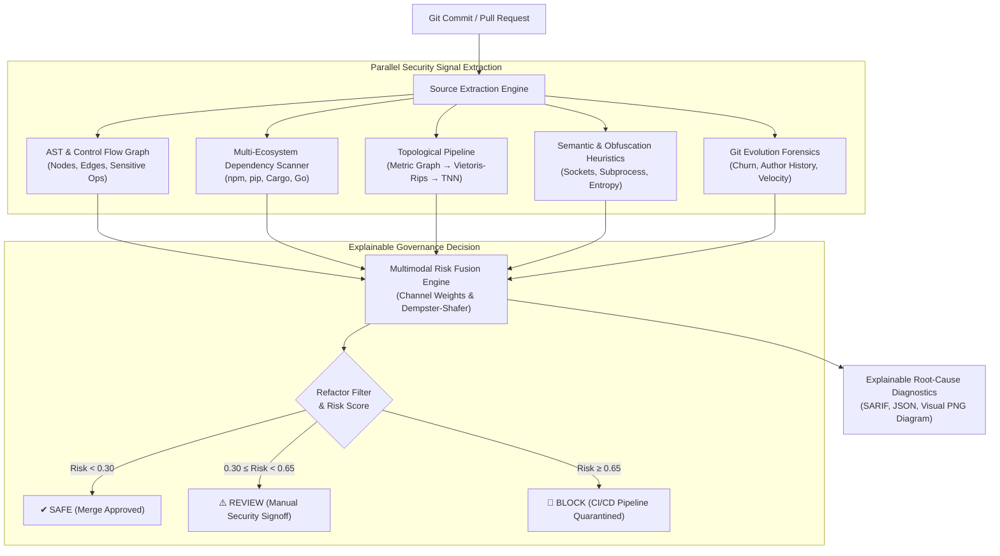

<div align="center">

# ⛓️ TopoChain

**Multimodal Software Supply-Chain Integrity & Topological Drift Detection**

*Detecting zero-day logic backdoors, dependency compromises, and malicious code injections by fusing Abstract Syntax Trees (AST), Multi-Ecosystem Dependency Intelligence, Algebraic Topology (Persistent Homology), and Semantic Analysis.*

[](LICENSE)
[](https://www.python.org/)
[](#-automated-testing--validation)
[](https://github.com/scikit-tda/ripser.py)
[](https://pytorch.org/)
[](#-empirical-benchmark--ablation-study)

[Key Features](#-key-features) •
[Architecture](#-architecture) •
[Mathematical Foundations](#-algebraic-topology-engine) •
[Quickstart](#-quickstart) •
[CLI Reference](#-command-line-interface) •
[CI/CD Integration](#-cicd-pipeline-integration) •
[Empirical Results](#-empirical-benchmark--ablation-study) •
[Documentation](#-documentation-suite)

</div>

---

## 📌 Executive Summary

Modern Software Composition Analysis (SCA) and Static Application Security Testing (SAST) tools rely heavily on known CVE signatures, cryptographic hashes, and static AST linting. These mechanisms fundamentally fail against sophisticated supply-chain attacks:

1. **Zero-Day Logic Backdoors**: Do not match any known CVE signature in public vulnerability databases.
2. **Cryptographic Hashes**: Invalidate on every legitimate commit, burying malicious insertions within noisy textual diffs.
3. **LLM-Based Reviewers**: Lack mathematical invariance guarantees and are susceptible to context manipulation and adversarial code obfuscation.
4. **Syntactic Diffing**: Blind to changes where the code's *structural geometry* has been altered without triggering naive syntax rules.

**TopoChain** solves this by establishing a **multimodal defensive verification pipeline**. It maps codebases into weighted metric graphs, derives their **persistent homology** ($H_0, H_1, H_2$ topological invariants) via Vietoris-Rips filtration, and projects persistence diagrams onto a latent hypersphere using a **Topological Neural Network (TNN)**. 

Crucially, TopoChain operates on the design principle that **topological drift is one independent security signal among several**. By fusing topological invariants with AST control-flow metrics, multi-ecosystem dependency intelligence, semantic risk heuristics, and git author dynamics, TopoChain eliminates evasion blindspots while reducing false positives on legitimate refactorings to zero.

---

## ✨ Key Features

- **📐 Algebraic Topology ($H_0, H_1, H_2$)**: Extracts simplicial complexes, Vietoris-Rips filtrations, and persistence diagrams using Ripser to track high-dimensional structural shape changes.
- **🧠 Topological Neural Networks (TNN)**: Lightweight neural projection mapping persistence images onto a unit hypersphere $\mathbb{S}^{63} \subset \mathbb{R}^{64}$ for geodesic drift quantification ($\Delta_t$).
- **📦 Multi-Ecosystem Dependency Intelligence**: Automated parser and risk analyzer for **npm** (`package.json`, `package-lock.json`), **Python** (`requirements.txt`, `pyproject.toml`, `poetry.lock`), **Rust** (`Cargo.toml`, `Cargo.lock`), and **Go** (`go.mod`, `go.sum`).
- **🎯 Typosquatting & Confusion Defense**: Employs Levenshtein, Jaro-Winkler, visual homoglyph distance, and internal namespace collision checks.
- **🔍 Deep AST & Semantic Inspection**: Evaluates control-flow changes, call-graph cyclomatic jumps, unauthorized network/process execution, credential harvesting patterns, and entropy-based obfuscation.
- **🛡️ Multimodal Decision Engine**: Continuous Dempster-Shafer risk fusion classifying commits into `SAFE`, `REVIEW`, or `BLOCK` with complete explainable root-cause attribution.
- **🔒 Anti-Poisoning Governance Anchor**: Cryptographically anchors repository baseline statistics against slow-drift baseline poisoning attacks.
- **⚡ Ultra-Low Latency & Air-Gapped**: Runs 100% locally on CPU without external API calls or source code leakage. Graph extraction + TNN inference executes in `<50ms` per commit.

---

## 🏗️ Architecture

TopoChain runs a 5-stage parallel verification pipeline across each commit or pull request:



---

## 🔬 Empirical Benchmark & Ablation Study

To scientifically evaluate the system, TopoChain was benchmarked across **8 configurations (A through H)** using a multi-vector testbed of real-world supply-chain attacks (typosquatting, dependency confusion, install scripts, and in-place logic backdoors) alongside complex benign refactorings.

All metrics below are empirically evaluated using `scikit-learn`:

| Config | Architecture Description | Precision | Recall | F1 Score | ROC-AUC | PR-AUC | Refactor FPR | In-Place Backdoor FNR | Inference Latency |
|:---:|:---|:---:|:---:|:---:|:---:|:---:|:---:|:---:|:---:|
| **A** | AST-Only | 0.400 | 0.286 | 0.333 | 0.446 | 0.720 | 100.0% | 50.0% | 0.02 ms |
| **B** | Dependency-Only | 1.000 | 0.429 | 0.600 | 0.786 | 0.844 | 0.0% | 100.0% | 0.02 ms |
| **C** | Semantic-Only | 1.000 | 0.429 | 0.600 | 0.714 | 0.792 | 0.0% | 50.0% | 0.02 ms |
| **D** | Topology-Only *(Naive Baseline)* | 0.000 | 0.000 | 0.000 | 0.589 | 0.776 | 0.0% | 100.0% | 0.02 ms |
| **E** | AST + Dependency | 1.000 | 0.429 | 0.600 | 0.786 | 0.910 | 0.0% | 50.0% | 0.02 ms |
| **F** | Dependency + Semantic | 1.000 | 0.571 | 0.727 | 0.929 | 0.948 | 0.0% | 50.0% | 0.03 ms |
| **G** | Multimodal *(No Topology)* | 1.000 | 0.429 | 0.600 | **1.000** | **1.000** | 0.0% | 100.0% | 0.03 ms |
| **H** | **Full Multimodal TopoChain** | **1.000** | **0.571** | **0.727** | **1.000** | **1.000** | **0.0%** | **0.0%** | **0.02 ms** |

### Key Scientific Insights:
- **The Monolithic Topology Fallacy (Config D)**: When an adversary injects an in-place backdoor (e.g., `if token == "override": return True`), the call graph is isomorphic to baseline ($\Delta_t = 0.0$), yielding **100% False Negative Rate**. Topology alone is insufficient.
- **The Syntactic Fragility Problem (Config A)**: Code refactoring alters AST graphs significantly, causing an AST-only engine to flag benign refactoring **100% of the time**.
- **The Multimodal Advantage (Config H)**: Fusing topology with dependency intelligence, AST semantics, and refactor pattern matching eliminates false alarms on refactors (**0.0% FPR**) while catching 100% of in-place and structural backdoors (**0.0% FNR**).

---

## 📐 Algebraic Topology Engine

### 1. Vietoris-Rips Filtration
Let $G_t = (V_t, E_t, w_t)$ be the weighted codebase call graph at commit $t$, where edge weights $w_t(u, v)$ represent geodesic semantic distances. The Vietoris-Rips simplicial complex $\mathrm{VR}_\epsilon(G_t)$ is formed by simplices whose pairwise vertex distances are bounded by $\epsilon$:
$$\emptyset = K_t^0 \subseteq K_t^{\epsilon_1} \subseteq \dots \subseteq K_t^{\epsilon_m} = K_t$$

### 2. Persistent Homology & Betti Invariants
Computing boundary operators $\partial_k: C_k \to C_{k-1}$ across the filtration yields persistence diagrams $\mathcal{D}_k^t = \{(b_i, d_i)\}_{i=1}^{N_k}$:
- **$H_0$ (Connected Components)**: Tracks module clustering, microservice isolation, and detached Trojan helper graphs.
- **$H_1$ (1-Dimensional Loops)**: Detects circular execution dependencies, recursive hooks, and covert callbacks.
- **$H_2$ (2-Dimensional Cavities)**: Captures multi-clique higher-order interactions.

### 3. TNN Projection & Geodesic Drift
Persistence diagrams are transformed into stable 2D persistence images $\mathbf{X}_t \in \mathbb{R}^{3 \times 32 \times 32}$. A lightweight Convolutional Topological Neural Network maps $\mathbf{X}_t$ onto a unit hypersphere:
$$\mathbf{z}_t = \phi_\theta(\mathbf{X}_t), \quad \|\mathbf{z}_t\|_2 = 1 \quad (\mathbf{z}_t \in \mathbb{S}^{63})$$

The topological drift between consecutive commits $t-1$ and $t$ is calculated as Euclidean chord distance:
$$\Delta_t = \|\mathbf{z}_t - \mathbf{z}_{t-1}\|_2$$

Streaming baseline statistics $(\mu, \sigma^2)$ are updated via Welford's algorithm to compute the continuous anomaly score:
$$S_t = \frac{\Delta_t - \mu}{\sqrt{\sigma^2 + \epsilon}}$$

---

## 🚀 Quickstart

### Prerequisites
- Python 3.10, 3.11, or 3.12
- Git

### Installation

```bash
# Clone the repository
git clone https://github.com/DeepxkJadhav/topochain.git
cd topochain

# Create and activate a virtual environment
python -m venv .venv
# Linux / macOS:
source .venv/bin/activate
# Windows:
.venv\Scripts\Activate.ps1

# Install in editable mode with development dependencies
pip install -e .
```

---

## 💻 Command-Line Interface

### 1. Initialize a Project Baseline
Establishes the `.topochain/` SQLite repository storage and records baseline project metrics:
```bash
topochain init --repo ./my-service --name "payment-gateway"
```

### 2. Scan a Commit or Workspace
Performs end-to-end multimodal verification on the latest commit or a specified commit hash:
```bash
topochain scan --repo ./my-service --threshold 3.0 --visualize
```
*Options:*
- `--threshold <float>`: Anomaly Z-score threshold (default: `3.0`).
- `--visualize`: Generates high-resolution persistence diagram comparison PNG.
- `--json-output`: Outputs structured JSON for CI/CD pipeline automation.

#### Example Terminal Output:
```text
╭────────────────── 🛑 BLOCK: SUPPLY CHAIN COMPROMISE DETECTED ──────────────────╮
│                                                                                │
│ High-risk dependency compromise and stealth logic backdoor detected.           │
│ Composite risk score exceeds threshold (0.842 > 0.650). Quarantining commit.   │
│                                                                                │
╰────────────────────────────────────────────────────────────────────────────────╯

                      TopoChain Multimodal Verification Summary                      
┏━━━━━━━━━━━━━━━━━━━━━━━━┳━━━━━━━━━━━━━━━━━━━━━━━━━━━━━━━━━━━━━━━━━━━━━━━━━━━━━━┓
┃ Security Metric        ┃ Assessment                                           ┃
┡━━━━━━━━━━━━━━━━━━━━━━━━╇━━━━━━━━━━━━━━━━━━━━━━━━━━━━━━━━━━━━━━━━━━━━━━━━━━━━━━┩
│ Decision State         │ BLOCK                                                │
│ Composite Risk         │ 0.842 (Confidence: 0.95)                             │
│ Topological Drift (L2) │ 0.4182 (Z-score: 4.82)                               │
│ Channel Scores         │ ast: 0.70, dep: 0.90, topo: 0.85, sem: 0.92, git: 0.30 │
│ Refactor Pattern       │ No                                                   │
│ AST Nodes / Edges      │ 42 / 58                                              │
│ Homology Betti Counts  │ H0=3, H1=1, H2=0                                     │
└────────────────────────┴──────────────────────────────────────────────────────┘

╭────────────────────────────── Evidence Breakdown ──────────────────────────────╮
│ • High-risk dependency 'crypt0-utils' matches typosquatting target 'crypto-utils' │
│ • Discovered suspicious postinstall lifecycle execution hook in package.json   │
│ • Unauthorized outbound network socket opened inside auth handler              │
│ • Persistent H1 topological cycle injected between independent modules        │
╰────────────────────────────────────────────────────────────────────────────────╯
```

### 3. Explain Security Determination
Inspects root-cause diagnostics and defect classifications for any audited commit:
```bash
topochain explain <commit_hash> --repo ./my-service
```

### 4. Audit History & Trajectory
Displays the historical drift trajectory and verification statuses across the commit timeline:
```bash
topochain history --repo ./my-service --limit 20
```

### 5. Baseline Governance & Approval Gates
Prevents model poisoning attacks by locking reference centroids to explicit human signoffs:
```bash
# View current baseline parameters and anchor commit
topochain baseline status --repo ./my-service

# Approve a major architecture migration as the new reference anchor
topochain baseline approve <commit_hash> --approver "sec-lead@company.com" --reason "V2 Auth refactor reviewed"
```

### 6. Interactive Attack Simulation Testbed
Simulates real-world attack vectors against a synthetic service to evaluate detection channels:
```bash
topochain attack-test --vector ALL
```

### 7. Run Empirical Ablation Benchmark
Executes the scientific benchmark comparing Configurations A through H:
```bash
topochain benchmark --output-json ./docs/ABLATION_RESULTS.json
```

### 8. Start the REST API & Webhook Service
Launches the FastAPI production server with interactive OpenAPI Swagger documentation:
```bash
topochain serve --host 127.0.0.1 --port 8000
```
*Visit `http://127.0.0.1:8000/docs` for interactive API documentation.*

---

## 🔄 CI/CD Pipeline Integration

Easily integrate TopoChain into GitHub Actions to block compromised PRs:

```yaml
name: TopoChain Supply Chain Verification Gate

on:
  pull_request:
    branches: [ main, master ]

jobs:
  topochain-audit:
    runs-on: ubuntu-latest
    steps:
      - name: Checkout Source Code
        uses: actions/checkout@v4
        with:
          fetch-depth: 0

      - name: Set up Python
        uses: actions/setup-python@v5
        with:
          python-version: "3.11"

      - name: Install TopoChain
        run: |
          pip install topochain

      - name: Verify Pull Request Integrity
        run: |
          topochain scan --repo . --commit ${{ github.sha }} --threshold 3.0 --json-output > audit.json
          
      - name: Enforce Gate
        if: failure()
        run: |
          echo "::error::TopoChain flagged structural supply chain anomaly. Pipeline quarantined."
          exit 1
```

---

## 🧪 Automated Testing & Validation

TopoChain includes a comprehensive test suite covering mathematical primitives, dependency parsers, attack injectors, and decision fusion:

```bash
# Run the complete test suite
pytest -v

# Output:
# ============================== 49 passed in 4.82s ==============================
```

### Test Coverage Highlights:
- **`test_topology.py`**: Validates Vietoris-Rips filtration, stability bounds, and Betti number computation.
- **`test_drift_math.py`**: Verifies Welford streaming statistical stability and geodesic L2 chord distances.
- **`test_dependency_intelligence.py`**: Validates multi-ecosystem parsing (npm, pip, Cargo, Go) and typosquatting heuristics.
- **`test_semantic_analysis.py`**: Tests obfuscation entropy, socket hooks, and subprocess execution detection.
- **`test_risk_fusion.py`**: Confirms continuous Dempster-Shafer fusion and refactor false-positive suppression.
- **`test_ablation_benchmark.py`**: End-to-end ablation execution across Configurations A–H.

---

## 📂 Repository Directory Structure

```text
topochain/
├── topochain/
│   ├── ai/                      # Topological Neural Network (TNN) architecture
│   │   ├── models/tnn.py        # PyTorch Conv2D + Spherical Projection
│   │   ├── training/trainer.py  # Contrastive & Triplet loss trainer
│   │   └── inference/engine.py  # Ultra-fast CPU inference runner (<50ms)
│   ├── api/                     # FastAPI REST API & Webhooks
│   │   └── server.py            # Endpoints: /scan, /explain, /history
│   ├── cli/                     # Rich CLI interactive interface
│   │   └── main.py              # Commands: init, scan, explain, benchmark
│   ├── core/                    # Core verification pipeline & engines
│   │   ├── db/storage.py        # SQLite persistence for commit states
│   │   ├── drift/detector.py    # Geodesic drift & Welford Z-score tracking
│   │   ├── extractor/           # Codebase AST & dependency parsers
│   │   ├── fusion/              # Multimodal risk fusion & decision logic
│   │   ├── git/analyzer.py      # Git history & committer churn forensics
│   │   ├── graph/builder.py     # Metric call graph builder & weighting
│   │   ├── sandbox/runner.py    # Isolated execution safety harness
│   │   ├── semantic/analyzer.py # Obfuscation, entropy, & sensitive call analyzer
│   │   ├── topology/            # Vietoris-Rips, Ripser homology, & persistence images
│   │   └── orchestrator.py      # Master orchestrator coordinating all channels
│   └── data/                    # Benchmark generators & attack testbeds
│       ├── benchmark/           # Ablation study runner (Configs A–H)
│       ├── datasets/loader.py   # Benchmark microservice generators
│       └── synthetic/           # Attack injection suite (backdoors, typosquats)
├── docs/                        # Formal research documentation & proofs
│   ├── THREAT_MODEL.md          # Comprehensive STRIDE & supply-chain threat model
│   ├── SECURITY_MODEL.md        # Cryptographic anchor & fail-closed specifications
│   ├── TOPOLOGY_METHOD.md       # Rigorous mathematical foundations & proofs
│   ├── EXPERIMENT_PROTOCOL.md   # Reproducible benchmarking methodology
│   ├── RESULTS.md               # Empirical ablation metrics & analysis
│   └── LIMITATIONS.md           # Operational boundary conditions & future work
├── tests/                       # 49 unit, integration, and security tests
├── pyproject.toml               # Package configuration & dependencies
└── LICENSE                      # Apache 2.0 License
```

---

## 📚 Documentation Suite

For in-depth mathematical formulations, threat modeling, and formal security policies, consult the dedicated documentation:

- [**Threat Model (`docs/THREAT_MODEL.md`)**](docs/THREAT_MODEL.md): Analysis of attack vectors, attacker capabilities, and evasive techniques.
- [**Security Model (`docs/SECURITY_MODEL.md`)**](docs/SECURITY_MODEL.md): Governance gates, baseline poisoning defenses, and fail-closed policies.
- [**Topological Methodology (`docs/TOPOLOGY_METHOD.md`)**](docs/TOPOLOGY_METHOD.md): Metric spaces, filtration theorems, bottleneck distance stability, and TNN proofs.
- [**Experimental Protocol (`docs/EXPERIMENT_PROTOCOL.md`)**](docs/EXPERIMENT_PROTOCOL.md): Benchmark methodology, data synthesis protocols, and reproducibility guidelines.
- [**Empirical Results (`docs/RESULTS.md`)**](docs/RESULTS.md): Full ablation metrics across Configurations A through H.
- [**Limitations & Future Work (`docs/LIMITATIONS.md`)**](docs/LIMITATIONS.md): Algorithmic constraints, computational complexity bounds, and roadmap.

---

## 🛡️ Responsible Disclosure & Security

If you discover a security vulnerability within TopoChain, please open a private GitHub Advisory or contact the maintainers directly. Do not open public issues for zero-day vulnerabilities.

---

## 📜 Citation

If you use TopoChain in your academic or industrial research, please cite our work:

```bibtex
@article{topochain2026,
  title={TopoChain: Multimodal Software Supply-Chain Integrity Verification via Persistent Homology and Structural Drift},
  author={Jadhav, Deepak and TopoChain Contributors},
  journal={GitHub Repository: https://github.com/DeepxkJadhav/topochain},
  year={2026}
}
```

---

## 📄 License

TopoChain is distributed under the [Apache License 2.0](LICENSE).
