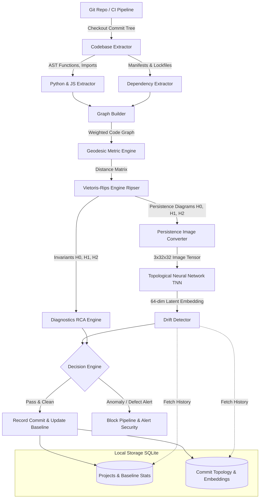

# TopoChain System Architecture

This document details the architectural design, subsystem interaction, data pipelines, and security threat model of **TopoChain**.



---

## 1. Subsystem Architecture

### 1.1 Extractor Layer (`topochain.core.extractor`)
- **`PythonASTExtractor`**: Native Python abstract syntax tree parsing via `ast`. Identifies definitions (`FunctionDef`, `AsyncFunctionDef`, `ClassDef`), invocations (`ast.Call`), imports (`ast.Import`, `ast.ImportFrom`), cyclomatic complexity branching, and sensitive API patterns (`urllib`, `socket`, `subprocess`, `os.system`, `base64`, `eval`, `exec`).
- **`JavaScriptExtractor`**: Regex- and lexical-pattern parser for JS/TS, arrow functions, `require()`, `import`, and sensitive execution sinks (`fetch`, `child_process`, `eval`).
- **`DependencyExtractor`**: Manifest parser supporting `requirements.txt`, `pyproject.toml`, `package.json`, and `go.mod`. Implements Damerau-Levenshtein distance and leetspeak substitution detection to intercept typosquatting candidates.
- **`CodebaseExtractor`**: Unified scanner orchestrating recursive file inspection while filtering irrelevant paths (`.git`, `node_modules`, `.venv`).

### 1.2 Graph & Metric Layer (`topochain.core.graph`)
- **`TopologicalMetricWeighting`**: Assigns metric distances to edges:
  - Local intra-module invocation: $d = 0.20$
  - Inter-module invocation: $d = 0.50$
  - External dependency link: $d = 0.75$
  - Modulated by cyclomatic complexity and security sensitivity.
- **`GraphBuilder`**: Constructs `networkx.DiGraph`, undirected projection, and computes all-pairs shortest paths using Dijkstra to generate the metric distance matrix bounded to $[0, 1]$.

### 1.3 Algebraic Topology Engine (`topochain.core.topology`)
- **`PersistentHomologyEngine`**: Fast simplicial filtration using Ripser up to homology dimension 2 ($H_0$: components, $H_1$: cycles/loops, $H_2$: voids).
- **`PersistenceImageConverter`**: Transforms $(b_i, d_i)$ point clouds into discretized $(3, 32, 32)$ multi-channel tensors using weighted Gaussian smoothing kernels.
- **`TopologicalVisualizer`**: Renders ASCII persistence barcodes in terminal and saves high-resolution multi-panel matplotlib figures.

### 1.4 AI & Topological Neural Network (`topochain.ai`)
- **`TopologicalNeuralNetwork` (TNN)**:
  - Multi-scale 2D CNN with residual blocks.
  - Dual global average + max pooling.
  - Projection head mapping to a unit hypersphere $\mathbb{S}^{63} \subset \mathbb{R}^{64}$ ($\|\mathbf{z}\|_2 = 1$).
- **`TNNInferenceEngine`**: CPU-optimized inference service with sub-50ms latency.
- **`TopologicalTrainer`**: Triplet and contrastive loss training on historical benign snapshots vs. synthetic topological perturbations.

### 1.5 Drift & Diagnostics Layer (`topochain.core.drift`)
- **`TopologicalDriftDetector`**: Evaluates step drift $\Delta_t = \|\mathbf{z}_t - \mathbf{z}_{t-1}\|_2$, centroid drift, running mean $\mu$, sample variance $\sigma^2$, and anomaly Z-score $S_t$.
- **`TopologicalDiagnosticsEngine`**: Root Cause Analysis (RCA) that maps abstract topological anomalies back to source AST entities:
  - `LOOP_BIRTH_ANOMALY`: unexpected 1D cycles in call hierarchy.
  - `SUSPICIOUS_SENSITIVE_HOOK_INJECTION`: new AST nodes interacting with sensitive APIs.
  - `UNCONNECTED_ISLAND_INJECTION`: unintegrated components.

### 1.6 Storage Layer (`topochain.core.db`)
- **`StorageEngine`**: Zero-dependency SQLite backend storing:
  - `projects`: Project metadata and anchors.
  - `commit_topology`: Commit hashes, serialized persistence images, latent embeddings, drift scores, and diagnostics.
  - `baseline_stats`: Running mean, variance, and sample count.

---

## 2. CI/CD Integration Guide

TopoChain integrates seamlessly into GitHub Actions or GitLab CI.

```yaml
name: TopoChain Supply Chain Verification

on: [push, pull_request]

jobs:
  verify-topology:
    runs-on: ubuntu-latest
    steps:
      - uses: actions/checkout@v4
        with:
          fetch-depth: 0

      - name: Set up Python
        uses: actions/setup-python@v5
        with:
          python-version: "3.11"

      - name: Install TopoChain
        run: pip install topochain

      - name: Verify Topological Integrity
        run: |
          topochain scan --commit ${{ github.sha }} --threshold 3.0 --visualize
```

If a malicious commit alters the codebase's topological invariants, TopoChain exits with code 1, automatically blocking the PR or deployment.
