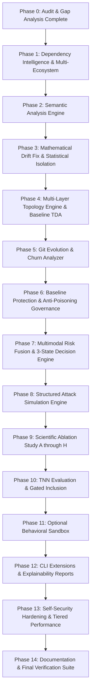

# TopoChain — Migration Plan

This document establishes the step-by-step engineering roadmap for upgrading TopoChain from a topology-only proof-of-concept into a scientifically grounded, multimodal supply chain integrity platform.

---

## 1. Migration Strategy & Principles

1. **Zero Regression Guarantee:** All existing 18 tests in `tests/` must remain passing throughout the migration.
2. **Modular Channel Architecture:** Each security signal (AST, Dependency, Topology, Semantic, Git, Sandbox) will be implemented as an independent analyzer conforming to a standard `SecuritySignalAnalyzer` interface.
3. **Decoupled Risk Fusion:** The decision engine will aggregate normalized channel signals into a calibrated composite risk score, routing to `SAFE`, `REVIEW`, or `BLOCK`.
4. **Empirical Baseline First:** Learned neural models (TNN) will be gated behind the scientific ablation study. We first validate classical topological invariants (Wasserstein distance, persistence images) against simpler baselines.

---

## 2. File & Module Evolution Plan

```text
topochain/
├── core/
│   ├── extractor/
│   │   ├── base.py                   -> Extended with semantic & capability schemas
│   │   ├── python_extractor.py       -> Enhanced with CFG & dataflow tracking
│   │   ├── js_extractor.py           -> Upgraded with token/AST extraction
│   │   ├── dependency_extractor.py   -> Upgraded to Multi-Ecosystem Intelligence
│   │   └── codebase_extractor.py     -> Hardened with path traversal guards
│   ├── graph/
│   │   ├── builder.py                -> Multi-layer graph builder (Call, Dependency, AST)
│   │   └── weighting.py              -> Strict metric space distance modeling
│   ├── topology/
│   │   ├── homology.py               -> Inconclusive state reporting & Wasserstein distance
│   │   ├── pers_image.py             -> Retained
│   │   └── visualizer.py             -> Enhanced comparative overlay (N-1 vs N)
│   ├── drift/
│   │   ├── detector.py               -> Mathematical fix: isolated scalar drift & quantiles
│   │   └── diagnostics.py            -> Root cause analysis linked to multimodal evidence
│   ├── semantic/                     -> [NEW] Dedicated semantic analysis layer
│   │   ├── __init__.py
│   │   └── analyzer.py               -> Sensitive API, auth bypass, credential theft analysis
│   ├── git/                          -> [NEW] Git history & evolution analysis layer
│   │   ├── __init__.py
│   │   └── analyzer.py               -> Velocity, churn, author entropy, timing anomalies
│   ├── sandbox/                      -> [NEW] Isolated behavioral analysis subsystem
│   │   ├── __init__.py
│   │   └── runner.py                 -> Safe mock/container process observation
│   ├── fusion/                       -> [NEW] Multimodal risk fusion & decision engine
│   │   ├── __init__.py
│   │   ├── risk_engine.py            -> Weighted/calibrated multimodal score aggregation
│   │   └── decision_engine.py        -> 3-state logic: SAFE, REVIEW, BLOCK
│   ├── db/
│   │   └── storage.py                -> Upgraded with Baseline Protection & Anchor governance
│   └── orchestrator.py               -> Upgraded to full multimodal orchestrator
├── data/
│   ├── synthetic/
│   │   └── attack_generator.py       -> Upgraded: structured attacks, topology-preserving suite
│   └── benchmark/                    -> [NEW] Benchmark runner & ablation evaluation harness
│       ├── __init__.py
│       └── ablation_runner.py        -> Evaluates configurations A through H (ROC-AUC, F1, PR-AUC)
├── cli/
│   └── main.py                       -> Extended CLI: history, explain, baseline, attack-test, benchmark
└── api/
    └── server.py                     -> Updated schemas for multimodal evidence & 3-state decisions
```

---

## 3. Phased Implementation Sequence



### Detailed Phase Milestones:

- **Milestone 1 (Phases 1-3): Foundation & Core Signal Hardening**
  - Fix drift mathematics in `detector.py`: scalar drift $\Delta_t$, $Z$-score with $10^{-8}$ epsilon, quantile calculation ($p_{50}, p_{90}, p_{99}$), and strict separation from vector embeddings.
  - Upgrade `dependency_extractor.py` to support `npm` (with `postinstall`/`preinstall` scripts), `Python` (`requirements.txt`, `pyproject.toml`, `poetry.lock`), `Go` (`go.mod`), and `Rust` (`Cargo.toml`, `Cargo.lock`). Add dependency confusion analysis.
  - Implement `SemanticEngine` in `topochain/core/semantic/analyzer.py` detecting sensitive capabilities (network, filesystem, subprocess, credentials, env vars, dynamic execution).

- **Milestone 2 (Phases 4-7): Fusion, Decision & Baseline Protection**
  - Implement `GitEvolutionAnalyzer` in `topochain/core/git/analyzer.py` tracking churn, commit velocity, and author entropy.
  - Upgrade `StorageEngine` to enforce **Baseline Protection**: trusted anchor commit, explicit approval workflow (`baseline approve`), immutable reference, gradual drift tracking, and tamper audit logs.
  - Implement `RiskFusionEngine` and `DecisionEngine` in `topochain/core/fusion/` producing `SAFE`, `REVIEW`, and `BLOCK`. Ensure major legitimate refactors resolve to `REVIEW`.

- **Milestone 3 (Phases 8-10): Scientific Validation & Attack Simulation**
  - Implement `AttackSimulationEngine` producing structured benchmark test cases (`attack_id`, `ground_truth`, `is_topology_changing`), with both topology-changing and **topology-preserving** backdoors.
  - Build automated ablation evaluation harness (`ablation_runner.py`) testing configurations $A$ through $H$.
  - Compute empirical metrics: Precision, Recall, $F_1$, ROC-AUC, PR-AUC, FPR, FNR, Latency, and Memory.

- **Milestone 4 (Phases 11-14): Sandbox, Explainability, CLI & Hardening**
  - Implement isolated `BehavioralSandbox` interface without untrusted host execution.
  - Extend CLI with `history`, `explain`, `baseline status`, `baseline approve`, `attack-test`, `benchmark`, `report`.
  - Add path-traversal sanitization, parser timeout guards, and graph size caps.
  - Author formal documentation: `THREAT_MODEL.md`, `SECURITY_MODEL.md`, `TOPOLOGY_METHOD.md`, `EXPERIMENT_PROTOCOL.md`, `RESULTS.md`, `LIMITATIONS.md`.
